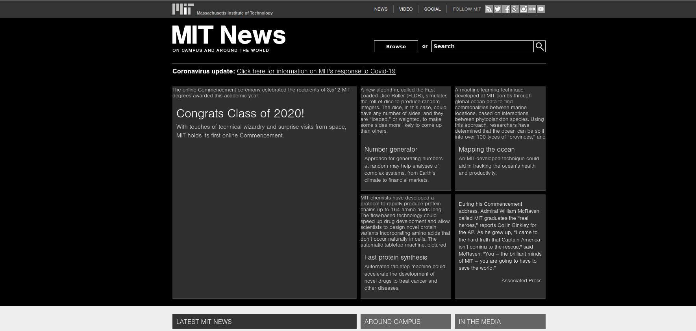

# AdBlock

## Звпуск
`python3 main.py PORT`

Блокируемые url нужно записать в файл block.txt как регулярное выражение.

Например, `.*images.*` заблокирует все картинки на сайте [MIT](http://news.mit.edu/), что приведет к такому результату:

Тестировалось с помощью браузера mozilla - указывался HTTP proxy. HTTPS не поддерживается.
