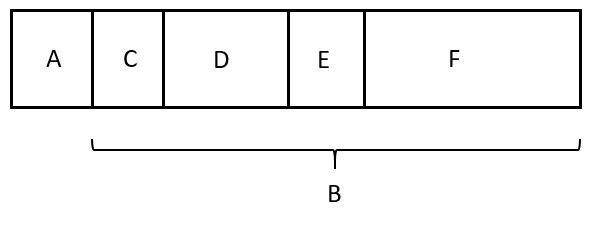

# Протокол взаимодействия

1. клиент отправляет сообщение серверу
2. сервер рассылает сообщение всем подключенным клиентам(в том числе отправителю), добавляя метку времени
3. клиент печатает на экран все полученные сообщения

* все числа записываются в формате big endian

## Протокол входных данных сервера

A(4 байта) - размер в байтах блока B

С(4 байта) - размер в байтах блока D

D(значение C байт) - имя отправителя(UTF-8, null-terminated)

E(4 байта) - размер в байтах блока F

F(значение E байт) - текст сообщения(UTF-8, null-terminated)

## Протокол входных данных клиента

A(8 байт) - метка времени unix time

B(4 байта) - размер в байтах блока C

C(значение B байт) - имя отправителя(UTF-8, null-terminated)

D(4 байта) - размер в байтах блока E

E(значение D байт) - текст сообщения(UTF-8, null-terminated)
